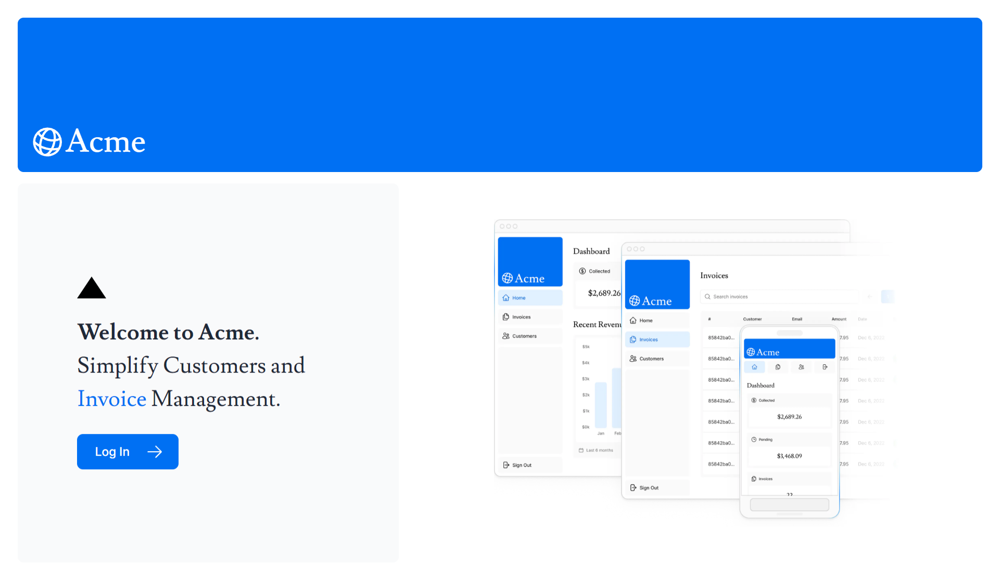

# Invoice Management Web App (Full-Stack) with Next.js

### All-in-one solution for effortless customer management and invoicing. You can easily

- manage customers,
- create invoices, and
- track transactions on a modern, user-friendly interface.

## Key Features:

- Customer & Invoice Management
- Invoice Tracking
- User Authentication and Authorization
- Scalability & Performance

### 🛠️ Technologies Used:

- **Full Stack**: Next.js, TypeScript, React
- **Styling**: Tailwind CSS
- **Database**: PostgreSQL, Prisma
- **Authentication**: Auth.js
- **Form Validation**: Zod

<!-- <h4 align="left">Next.js | React | TypeScript | Tailwind CSS | PostgreSQL | Prisma | Auth.js | Zod</h4> -->

## Developer info 🧑‍💻

- Portfolio - [ [@sithuthedev](https://sithuthedev.vercel.app/) ]
- LinkedIn - [ [@sithu-aung-khant](https://linkedin.com/in/sithu-aung-khant) ]
- Twitter - [ [@sithu_thedev](https://twitter.com/sithu_thedev) ]
